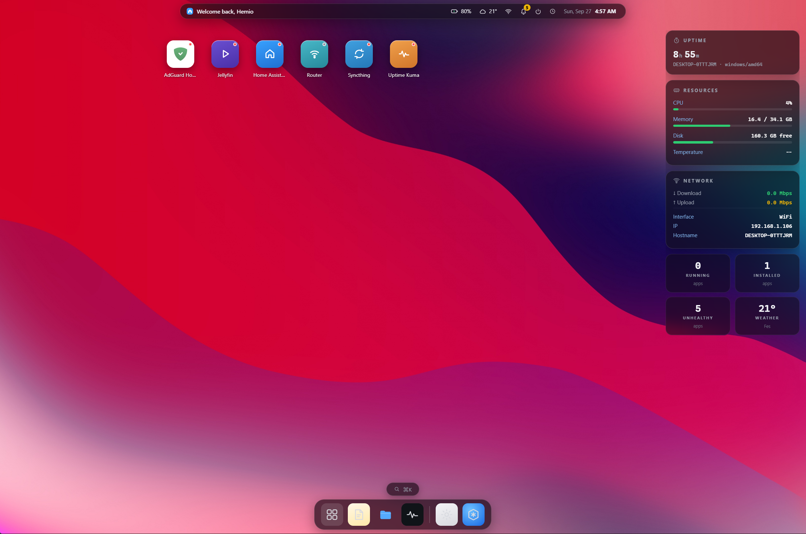
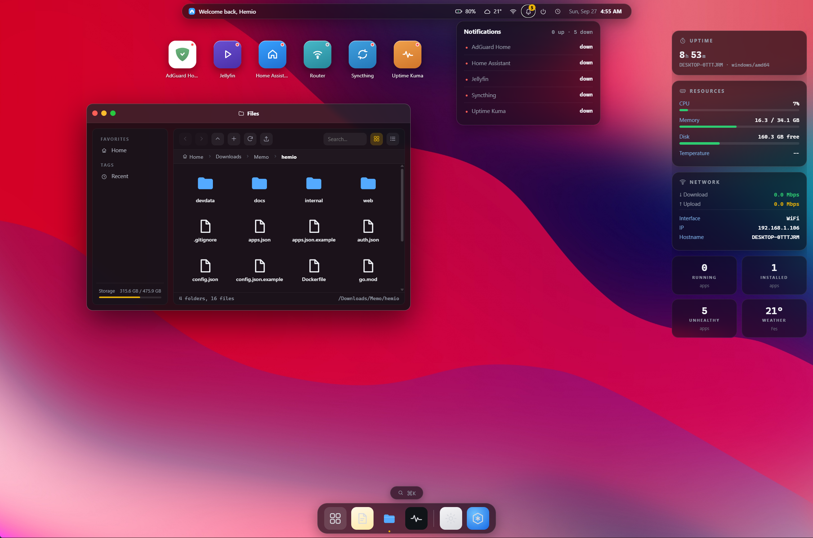
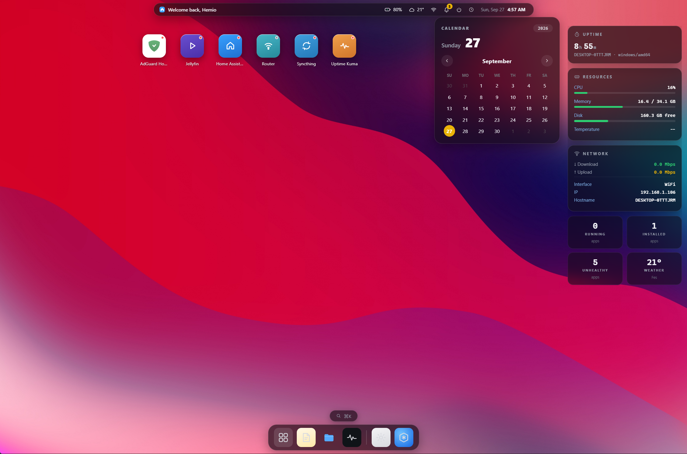
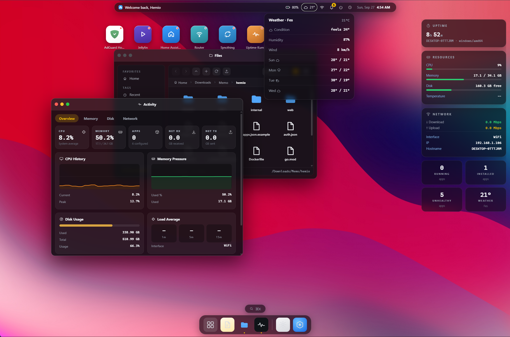

# ⬡ Hemio Dashboard

A self-hosted, single-binary desktop-style dashboard for your HomeLab — a tiny
macOS-flavored web desktop (menu bar, dock, floating windows, Spotlight,
Launchpad, widgets) that shows live system metrics, weather, battery, network,
your services' health, and a sandboxed file manager.

Built with **pure Go (stdlib only)** on the backend and **vanilla JavaScript**
on the frontend — no frameworks, no npm, no external assets. Everything is
embedded into one ~7 MB static binary (7.3 MB stripped `linux/amd64`).



---

## ✨ Features

### Desktop experience
- **Floating windows** — draggable, resizable, minimizable, with traffic-light controls and macOS-style overlay scrollbars.
- **Dock** with running-app indicators, **Launchpad** (one click hides *all* windows, click again restores them), and **Spotlight** (`⌘K` / `Ctrl+K`) for instant search of apps, windows and actions.
- **Widget rail**: Uptime, Resources (CPU / RAM / Disk / Temperature) and Network cards, plus a 2×2 stats grid (running / installed / unhealthy apps, live weather).
- **Menu-bar popups anchor under the icon you clicked** — Battery, Weather, Network, Notifications, Power, and a full interactive **Calendar** with month navigation and day details.
- **Consistent line-icon system** — ~60 hand-drawn inline SVG icons (SF-Symbol style, `currentColor` + 1.5px stroke) used across the menu bar, dock, windows and popups. No icon font, no CDN.

### Modules (each one is a window)
- **Files** — sandboxed file manager: browse, grid/list views, search, create
  folder, upload (multiple files), download, delete, **back / forward history**,
  **up** button and a clickable **breadcrumb** path bar. Locked to `files_root`
  with path-escape protection.
- **Activity Monitor** — CPU history and memory-pressure charts, disk usage bar,
  system load average, live network throughput, and headline stat tiles.
- **System Settings** — General (host info), Appearance (wallpaper, accent
  color, blur, transparency — persisted to `config.json` *and* `localStorage`),
  and Users & Access (change password, session duration 10/20/30/60 min).
- **Notes** — quick scratchpad window.
- **About This Hemio** — build/version info.

### Operations
- **Authentication** — PBKDF2-HMAC-SHA256 password hashing (stdlib),
  HttpOnly session cookie, configurable session lifetime. Disable entirely for
  trusted LANs with `HEMIO_NO_AUTH=1`
- **App grid from `apps.json`** with concurrent HTTP health probes and green/red status dots.
- **Weather** via Open-Meteo — no API key required.
- **Battery & power** read from the OS when available, gracefully hidden on VPS/container hosts.
- **Mobile responsive** — at phone widths the dock shrinks, sidebars collapse,
  windows open near-fullscreen, popups go full-width, and touch targets/hover
  states adapt (`@media (hover: none)`).
- **Zero telemetry.** The only outbound requests are the Open-Meteo weather API
  and your own health-check URLs.

---

## 🚀 Installation

### Requirements
Just [Go](https://go.dev/dl/) **1.27+** (see `go.mod`) to build. The binary
itself has no runtime dependencies — the frontend is embedded with `go:embed`.

### Build & run

```bash
git clone https://github.com/Sqartet/hemio.git
cd hemio
go build -ldflags="-s -w" -o hemio .
./hemio
# open http://localhost:8090
```

### Prebuilt binaries

Download the binary for your platform from the
[Releases page](https://github.com/Sqartet/hemio/releases), then:

```bash
chmod +x hemio-linux-amd64
./hemio-linux-amd64
```

### Docker

```bash
docker build -t hemio .
docker run -d --name hemio -p 8090:8090 \
  -v hemio-data:/data \
  -v /srv/yourfiles:/files:ro \
  -e HEMIO_FILES_ROOT=/files \
  hemio
```

The image runs as a non-root user, stores `config.json` / `apps.json` /
`auth.json` in the `/data` volume, and exposes port 8090.

### Cross-compile for any target

```bash
GOOS=linux   GOARCH=amd64 go build -ldflags="-s -w" -o hemio-linux-amd64 .   # VPS
GOOS=linux   GOARCH=arm64 go build -ldflags="-s -w" -o hemio-linux-arm64 .   # Raspberry Pi / Termux
GOOS=darwin  GOARCH=arm64 go build -ldflags="-s -w" -o hemio-mac-arm64   .   # Apple Silicon
GOOS=windows GOARCH=amd64 go build -ldflags="-s -w" -o hemio.exe          .   # Windows
```

---

## 🔐 First login

| username | password |
|---|---|
| `admin` | `admin123` |

> **Change it immediately** — the login page and System Settings both show a
> warning until you do. Set a new one (and the session length) in **System
> Settings → Users & Access**. Credentials live in `auth.json` (PBKDF2 hash +
> per-store random salt; the plaintext password is never written to disk).

To run the whole dashboard without login (e.g. behind a VPN or reverse proxy):

```bash
HEMIO_NO_AUTH=1 ./hemio
```

---

## ⚙️ Configuration

All state lives next to the binary, or in `$HEMIO_DATA_DIR`:

| File | Purpose |
|---|---|
| `config.json` | port, bind host, files sandbox root, weather geo, saved UI theme |
| `apps.json` | dashboard shortcuts: `title` / `url` / `icon` / `category` / `health_check` / `description` |
| `auth.json` | login credentials (auto-created with defaults, PBKDF2-hashed) |

Copy the shipped `.example` files to get started:

```bash
cp config.json.example config.json
cp apps.json.example   apps.json
```

Minimal `config.json`:

```json
{
  "name": "Hemio Dashboard",
  "port": 8090,
  "host": "0.0.0.0",
  "files_root": "",
  "health_interval_seconds": 15,
  "geo": { "city": "Casablanca", "lat": 33.5731, "lon": -7.5898 }
}
```

### Environment overrides

| Variable | Effect |
|---|---|
| `HEMIO_PORT` | listen port (default `8090`) |
| `HEMIO_HOST` | bind address (default `0.0.0.0`) |
| `HEMIO_DATA_DIR` | where `config.json` / `apps.json` / `auth.json` live |
| `HEMIO_FILES_ROOT` | sandbox root for the Files module (empty = data dir) |
| `HEMIO_NO_AUTH` | `1` disables login entirely (use on trusted networks only) |

---

## 🔌 HTTP API

All `/api/*` routes require a valid session cookie unless `HEMIO_NO_AUTH=1`.

| Route | Description |
|---|---|
| `POST /api/login` · `POST /api/logout` | session management (303 redirect on success) |
| `GET /api/auth/status` | `{enabled, username, session_minutes, default_password}` |
| `POST /api/auth/password` | change password (requires current password) |
| `POST /api/auth/session` | set session lifetime (10 / 20 / 30 / 60 minutes) |
| `GET /api/system` | metrics snapshot + per-app health + summary counters |
| `GET /api/apps` | `apps.json` contents |
| `GET /api/weather` | cached Open-Meteo current conditions + 5-day forecast |
| `GET` / `POST /api/settings` | UI theme read / persist into `config.json` |
| `GET /api/files?path=` | sandboxed directory listing |
| `GET /api/files/download?path=` | file download |
| `POST /api/files/mkdir?path=` | create folder |
| `POST /api/files/delete?path=` | delete file / folder |
| `POST /api/files/upload?path=` | multipart upload (multiple files) |

---

## 🧱 Architecture

```
main.go                  boot: config → auth → metrics → HTTP server
internal/
  config/                config.json + env overrides + atomic save
  auth/                  PBKDF2-HMAC-SHA256 (60k rounds), sessions, login/logout
  metrics/               CPU/RAM/disk/net/temp/battery, OS-specific probes
                         (Linux /proc, macOS sysctl, Windows registry+APIs)
  filestore/             sandboxed FS ops (path-escape guarded), disk usage
  server/                stdlib mux, routes, serves embedded web FS
web/
  embed.go               //go:embed all:static  → single binary
  static/
    index.html           desktop shell
    login.html           auth page
    css/style.css        theme + glassmorphism + responsive rules
    js/
      icons.js           inline-SVG icon system (no deps)
      windows.js         window manager (drag/resize/minimize/z-order)
      widgets.js         menu-bar popups, calendar, activity monitor,
                         launchpad, spotlight, dock, notes, about
      files.js           file manager (history + breadcrumb + upload)
      settings.js        System Settings window
      grid.js            desktop app tiles
      api.js             fetch helpers
      main.js            boot / wiring
```

The frontend is plain ES5-style scripts served as written — no bundler, no
`node_modules` — which keeps the whole thing auditable in a single `grep`.

---

## 🖼️ Screenshots

| Desktop & widgets | Files (breadcrumb + history) |
|---|---|
|  |  |
| **Calendar popup** | **Activity Monitor** |
|  |  |

> The `docs/` images were captured at 1440×900 — re-run after UI changes so the
> repo stays honest.

---

## 🔒 Security notes

- Sessions are HttpOnly + SameSite=Lax cookies; PBKDF2-HMAC-SHA256 with a
  per-store random salt (60k rounds by default).
- The Files module is jailed to `files_root` — every path is cleaned and verified against the root.
- No outbound calls except Open-Meteo (weather) and your own `health_check` URLs.
- Serve behind HTTPS (Caddy / nginx / Traefik) if it's ever exposed beyond your LAN. Running with `HEMIO_NO_AUTH=1` is **never** safe on the public internet.

---

## 🛣️ Roadmap ideas

- Window snapping & multitab windows
- More widgets (music player, download queue, cron view)
- i18n (menu bar & settings in more languages)
- Configurable dock & widget layout (drag to reorder)
- 2FA / TOTP for the login

PRs welcome — open an issue first for anything bigger than a typo. 🙂

## 📄 License

[MIT](LICENSE)
